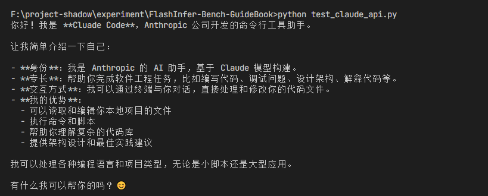

### FlashInferBench-Guidebook

推荐使用5090，经典配置


### 安装kimi

```shell
# Step 1：开加速（只为下载 uv，因为可能经过GitHub）
source /etc/network_turbo

# Step 2：跑一次（让 uv 安装下来），可能会报错：To add $HOME/.local/bin to your PATH，这是正常的
curl -L code.kimi.com/install.sh | bash

# Step 3：加载 uv
source $HOME/.local/bin/env

# Step 4：立刻关闭代理（关键！否则反而可能报错）
unset http_proxy
unset https_proxy

# Step 5：重新执行安装（走 PyPI）
curl -L code.kimi.com/install.sh | bash
```

登录：

```shell
/login
```

允许自动权限，`/root/.kimi/config.toml`当中改这个：

```shell
default_yolo = true
```

### 安装texlive

```shell
你现在的任务：帮我把texlive部署在这个服务器上，装入这个文件夹/root/texlive，autodl加速：source /etc/network_turbo（如果很慢的话），因为只是临时使用，可以安装一个基础版本。建议先去联网查一下texlive在linux上的部署教程。
```


### 安装open claw

```shell
你现在的任务：帮我把open claw部署在这个服务器上，装入这个文件夹/root/openclaw，autodl加速：source /etc/network_turbo（如果很慢的话）。建议先去联网查一下open claw在linux上的部署教程。
```


打开控制面板，需要使用带有网关令牌的链接`http://127.0.0.1:18789/#token=openclaw-1774591025-VOJlVQ6Hg6cwiI8y`（每个人可能不一样）

### 调通第三方的Claude

把第三方的api-key，模型名称，第三方链接都发给kimi，让它帮我们调通

```shell
#!/usr/bin/env python3
"""
Claude API 测试 (api123.icu)
模型: claude-sonnet-4-6
"""

import requests

API_KEY = "sk-fb8X8N7BMB1C63CJry15ISPIKgmZgtw7ME11GrkRIrg0eSCU"
URL = "https://api123.icu/v1/chat/completions"

def ask(question):
    resp = requests.post(URL, headers={
        "Authorization": f"Bearer {API_KEY}",
        "Content-Type": "application/json"
    }, json={
        "model": "claude-sonnet-4-6",
        "messages": [{"role": "user", "content": question}],
        "max_tokens": 500
    }, timeout=30)
    return resp.json()["choices"][0]["message"]["content"]

# 测试
if __name__ == "__main__":
    print(ask("你好！请介绍一下自己。"))
```

