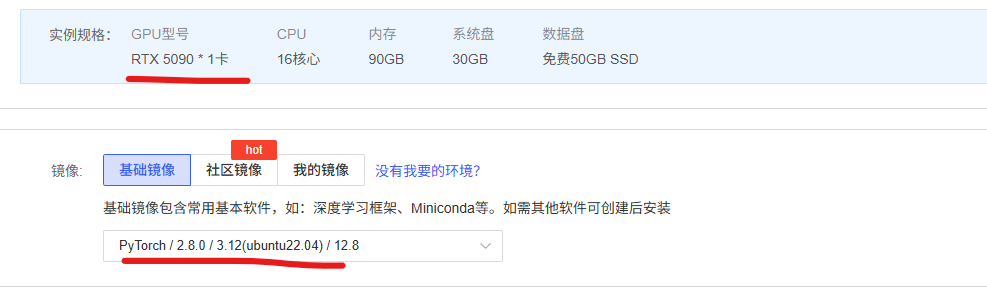
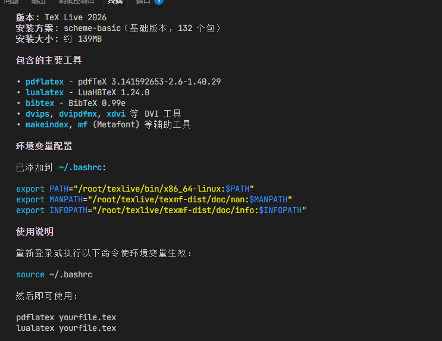
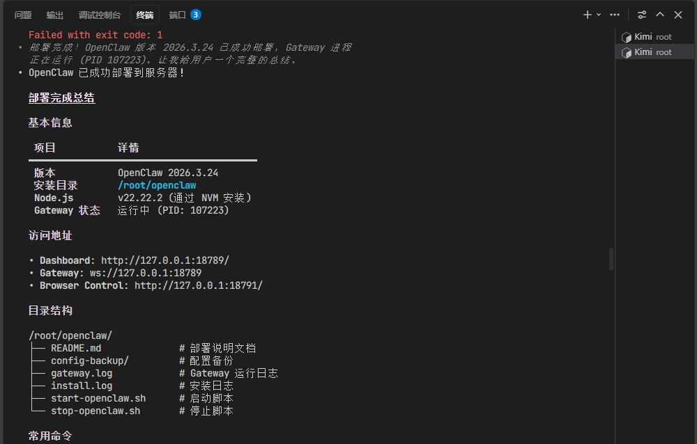

### FlashInferBench-Guidebook

推荐使用5090，经典配置



### 安装kimi

```shell
# Step 1：开加速（只为下载 uv，因为可能经过GitHub）
source /etc/network_turbo

# Step 2：跑一次（让 uv 安装下来），可能会报错：To add $HOME/.local/bin to your PATH，这是正常的
curl -L code.kimi.com/install.sh | bash

# Step 3：加载 uv
source $HOME/.local/bin/env

# Step 4：立刻关闭代理（关键！否则反而可能报错）
unset http_proxy
unset https_proxy

# Step 5：重新执行安装（走 PyPI）
curl -L code.kimi.com/install.sh | bash
```

登录：

```shell
/login
```

允许自动权限，`/root/.kimi/config.toml`当中改这个：

```shell
default_yolo = true
```

### 安装texlive

```shell
你现在的任务：帮我把texlive部署在这个服务器上，装入这个文件夹/root/texlive，autodl加速：source /etc/network_turbo（如果很慢的话），因为只是临时使用，可以安装一个基础版本。建议先去联网查一下texlive在linux上的部署教程。
```



### 安装open claw

```shell
你现在的任务：帮我把open claw部署在这个服务器上，装入这个文件夹/root/openclaw，autodl加速：source /etc/network_turbo（如果很慢的话）。建议先去联网查一下open claw在linux上的部署教程。
```



打开控制面板，需要使用带有网关令牌的链接`http://127.0.0.1:18789/#token=openclaw-1774591025-VOJlVQ6Hg6cwiI8y`（每个人可能不一样）

然后安排kimi去配置一下API，这里我用了kimi 2.5的API，可以尝试编译一下letax。

### 运行实验

```shell
你现在位于AutoDL的5090上，新版pytorch等一系列环境已经安装好了，网络卡的时候可以用`source /etc/network_turbo`加速。

我最近在复现一个名字叫做FlashInferBench的数据集，是用来测试大模型写算子能力的（写出的算子可以动态插入SGLang），你先去`https://github.com/flashinfer-ai/flashinfer-bench`把它拉下来，读一下README，在作者的所有脚本中，跑一个最小化的，或者测试一个仓库中的算子。因为我们时间紧迫，所以尽量跑单个示例就行，成功后，把结果写入模板/root/latex/acm-template/minimal-acm.tex，然后运行make clean && make编译，并把输出的pdf重命名为`FlashInferBench最小化实验报告.pdf`，作为你的最终答卷。
```

中间可能会偷懒，鞭策他一下，防止他自己写算子偷懒。

